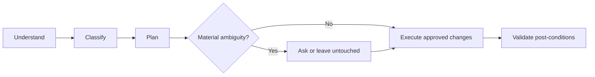

# AI Folder Governance

English | [繁體中文](README.zh-TW.md)

> AI should understand your files before organizing them.

A safe, adaptable framework for letting AI understand files before organizing them. It is designed for folders in local or cloud-backed workspaces, and remains useful whether the agent is a chat assistant, a command-line tool, or an automation embedded in another product.

## Problem

AI can move, rename, archive, or delete files quickly. Speed is not the hard part. The hard part is deciding what a file means, which copy is authoritative, what can safely change, and when uncertainty should stop automation.

This project gives that work a small, reusable contract:



## Why this is different

- Content is stronger evidence than filenames.
- Ownership and source-of-truth status matter more than topic similarity.
- Existing structure is preserved unless a change has clear value.
- A scan is not an organization, and an inventory is not a completed change.
- Every mutation has a dry-run plan, an approval boundary, a change ledger, and post-condition checks.
- A second run should be close to a no-op.

This is not a file manager, SaaS, MCP server, agent framework, database, or cloud service. It is a governance layer that can guide tools you already use.

## 30-second workflow

1. Give an agent one folder and ask for a read-only inventory.
2. Let it infer categories from content, ownership, links, dates, and dependencies.
3. Choose a mode and answer only questions that would materially change the result.
4. Review the proposed change set before moves, renames, archive actions, or deletion.
5. Execute approved changes, then validate that every post-condition is true.

## Three ways to use it

### Copy a prompt

Start with [01-single-folder-deep-organize](prompts/01-single-folder-deep-organize.md) for a complete one-folder review. The prompts are standalone and include their own safety rules.

### Install the Agent Skill

Copy [skills/ai-folder-governance](skills/ai-folder-governance/) into the skills directory supported by your agent runtime. The compact `SKILL.md` routes the agent to detailed references only when they are needed.

### Govern an advanced project workspace

Use [05-project-workspace-governance](prompts/05-project-workspace-governance.md) when one project spans a human workspace and a machine workspace such as a document provider and a Git repository. This module is optional; no provider is required.

## Quick Start

Paste this into an agent that can inspect the target folder:

```text
Use a read-only pass to understand this folder before changing anything.
Preserve existing structure unless a change has clear value. Classify by content,
ownership, source-of-truth status, and path dependencies. Do not delete anything.
Return an inventory, uncertainties, proposed organization mode, and a dry-run
change set. Ask only questions whose answers would materially change the result.
Wait for approval before moving, renaming, archiving, or deleting files. After
execution, report post-condition checks and any items left untouched.
```

For a repeatable workflow, use the full [prompt pack](prompts/) or the Skill.

## Before / After example

Before:

```text
project-notes/
├── final-notes.md
├── notes-new.md
├── export-2.pdf
└── links.txt
```

After a preserve-first plan is approved:

```text
project-notes/
├── 00-index.md
├── working/
│   └── notes-new.md
├── reference/
│   └── links.txt
└── review/
    ├── final-notes.md
    └── export-2.pdf
```

The agent should explain why `final-notes.md` remains in review when its authority is not proven. A confident filename is not proof of canonical status.

## Safety

The default is read-only inspection followed by a dry-run plan. Destructive deletion requires explicit confirmation, and exact duplicates are not deleted merely because they look identical. Secret-bearing files, credential stores, private configuration, and files with unresolved path dependencies form a black box: inspect metadata only when possible and leave contents untouched.

The framework distinguishes:

- `SCAN_PASS`: the target was inspected without violating the scope.
- `ORGANIZATION_PASS`: approved changes were applied and validated.
- `NO_CHANGE_NEEDED_PROOF`: no mutation was needed, with evidence explaining why.

See [Safety Model](docs/en/03-safety-model.md) and [Acceptance Gates](skills/ai-folder-governance/references/acceptance-gates.md).

## Preference discovery

The framework does not force one folder taxonomy. Start with read-only inspection, then ask only material questions about:

- restructure level: `preserve-first`, `moderate`, or `redesign`;
- depth: `current`, `one-level`, or `recursive`;
- archive strategy: keep in place, archive, or ask per item;
- deletion: confirm before destructive deletion by default;
- naming: ask about language, date prefix, or style only when renaming is actually needed.

Preferences may be saved in an optional `.ai-folder-governance.yaml`; safety invariants cannot be disabled by configuration.

## Architecture

The public package is intentionally small:

```text
prompts/                 Standalone workflows
skills/ai-folder-governance/
  SKILL.md               Compact entry point
  references/            Detailed rules and gates
  assets/                Safe, provider-neutral templates
docs/                    Bilingual explanation and guides
examples/                Small, fictional scenarios
tests/                   Regression cases and fixtures
scripts/                 Dependency-free validation
```

## Documentation

- [Concepts](docs/en/01-concepts.md) · [概念](docs/zh-TW/01-concepts.md)
- [How it works](docs/en/02-how-it-works.md) · [運作方式](docs/zh-TW/02-how-it-works.md)
- [Safety model](docs/en/03-safety-model.md) · [安全模型](docs/zh-TW/03-safety-model.md)
- [Preferences](docs/en/04-preferences.md) · [偏好設定](docs/zh-TW/04-preferences.md)
- [Prompt guide](docs/en/05-prompt-guide.md) · [Prompt 指南](docs/zh-TW/05-prompt-guide.md)
- [Skill guide](docs/en/06-skill-guide.md) · [Skill 指南](docs/zh-TW/06-skill-guide.md)
- [Project workspaces](docs/en/07-project-workspaces.md) · [專案工作區](docs/zh-TW/07-project-workspaces.md)

## Compatibility and validation

The prompts are provider-neutral. The Skill follows the current Agent Skills file shape: a folder with a `SKILL.md`, YAML front matter, and optional references and assets. The repository validator uses only Python's standard library:

```bash
python3 scripts/validate_repo.py
```

CI runs the same validator on pull requests and pushes.

## Contributing

Read [CONTRIBUTING.md](CONTRIBUTING.md) before proposing changes. Keep examples fictional, avoid provider-specific credentials or identifiers, and preserve the separation between inspection, approval, execution, and validation.

## License

Released under the [MIT License](LICENSE).
