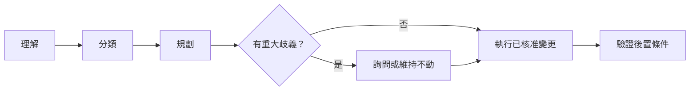

# AI 資料夾治理

[English](README.md) | 繁體中文

> AI 應該先理解你的檔案，再開始整理。

這是一套安全、可調整的框架，讓 AI 在整理檔案前先理解檔案。它適用於本機或雲端同步的工作區，不限於聊天助理、命令列工具或其他產品內的自動化 Agent。

## 要解決的問題

AI 可以很快移動、重新命名、封存或刪除檔案；真正困難的是判斷檔案的意義、哪一份是權威來源、哪些變更安全，以及何時應該因不確定而停止自動化。

本專案提供一個小而可重複使用的契約：



## 它的不同之處

- 內容比檔名更有判斷力。
- 所有權與來源真實性比主題相似度更重要。
- 除非變更有明確價值，否則保留現有結構。
- 掃描不是整理，完成清冊也不是完成變更。
- 每一項變更都要有 dry-run 計畫、核准邊界、變更紀錄與後置條件驗證。
- 第二次執行應該接近 no-op。

這不是檔案管理器、SaaS、MCP Server、Agent Framework、資料庫或雲端服務，而是一層可以引導既有工具的治理規則。

## 30 秒工作流程

1. 提供一個資料夾，要求 Agent 先做唯讀清冊。
2. 讓它根據內容、所有權、連結、日期與相依性推論分類。
3. 選擇整理模式，只回答會實質改變結果的問題。
4. 在移動、重新命名、封存或刪除前審查 proposed change set。
5. 執行已核准變更，並驗證每個後置條件。

## 三種使用方式

### 複製 Prompt

單一資料夾完整檢視可從 [01-single-folder-deep-organize](prompts/01-single-folder-deep-organize.md) 開始。每個 Prompt 都能單獨使用，並包含自己的安全規則。

### 安裝 Agent Skill

把 [skills/ai-folder-governance](skills/ai-folder-governance/) 複製到你的 Agent Runtime 支援的 skills 目錄。精簡的 `SKILL.md` 只在需要時導向詳細參考資料。

### 管理進階專案工作區

當一個專案同時跨越人類工作區與機器工作區，例如文件提供者與 Git Repository，可使用 [05-project-workspace-governance](prompts/05-project-workspace-governance.md)。這是選用模組，不要求特定提供者。

## 我應該選哪一條路？

| 如果你…… | 使用 | 結果 |
| --- | --- | --- |
| 只想整理一個資料夾 | [複製 Prompt](prompts/) | 可以直接貼給 Agent 的獨立流程。 |
| 經常使用 Agent | [安裝 Skill](skills/ai-folder-governance/) | 具備 references 的漸進式、可重複指引。 |
| 一個專案同時有文件與 Git／程式碼 | [Project Workspace Governance](prompts/05-project-workspace-governance.md) | 跨工作區的穩定 identity 與 source-of-truth 協調。 |

## Runtime 能力速查

| 能力 | Scan | Plan | Execute | Validate |
| --- | --- | --- | --- | --- |
| 只有聊天 | 使用者提供 inventory | 可以 | 不可以 | 只能依報告判斷 |
| 使用者提供 inventory | 使用提供的證據 | 可以 | 不可以 | 比對提供的證據 |
| 唯讀檔案系統 | 可以 | 可以 | 不可以 | 唯讀重掃 |
| 可讀寫檔案系統 | 可以 | 可以 | 已核准變更 | 可以 |
| 遠端工作區 connector | 視 connector 能力 | 可以 | 需寫入能力與核准 | connector 回讀 |
| Git + 檔案系統 | 可以 | 可以 | 已核准檔案變更；Git 動作另行處理 | 檔案系統加 Git 檢查 |

詳見 [Runtime 能力](docs/zh-TW/08-runtime-capabilities.md)，區分實測能力與設計上相容能力。

## 快速開始

把以下內容貼給能夠檢視目標資料夾的 Agent：

```text
先以唯讀方式理解這個資料夾，再做任何變更。
除非變更有明確價值，否則保留現有結構。根據內容、所有權、來源真實性與路徑相依性分類。
不要刪除任何內容。回傳清冊、不確定事項、建議整理模式與 dry-run change set。
只詢問答案會實質改變結果的問題。移動、重新命名、封存或刪除前等待核准。
執行後回報後置條件驗證，以及刻意維持不動的項目。
```

若要使用可重複的流程，請使用完整的 [Prompt Pack](prompts/) 或 Skill。

## 以證據為主的範例

### 整理前

```text
project-notes/
├── final-notes.md
├── notes-new.md
├── export-2.pdf
└── links.txt
```

### 觀察到的證據

- `notes-new.md` 是目前的 working material。
- `links.txt` 是 reference candidate。
- `final-notes.md` 與 `export-2.pdf` 的權威性不明。
- 不能只靠檔名證明需要刪除。

### Dry-run 提案

提議 `working/notes-new.md` 與 `reference/links.txt`。在權威性與路徑相依性釐清前，讓兩個 review candidate 留在原處。下面的資料夾名稱是提案，不是框架硬編的 taxonomy。

### 使用者決定

核准兩個低風險移動，讓 review candidate 維持不動，且不刪除任何內容。

整理後的狀態只能包含已出現在核准 change set 中的變更；未經核准的「順手整理」屬於 scope drift。

### 整理後

```text
project-notes/
├── final-notes.md
├── export-2.pdf
├── working/
│   └── notes-new.md
└── reference/
│   └── links.txt
```

實際結構取決於證據與使用者偏好。自信的檔名不是 canonical 狀態的證明。

## 安全性

預設先唯讀檢查，再產生 dry-run。破壞性刪除必須明確確認；檔案看起來是完全重複，也不能只因為相似就刪除。可能包含秘密的檔案、憑證儲存、私人設定，以及存在未解決路徑相依性的檔案，都是 black box：能只看 metadata 就不要讀取內容，並在必要時維持不動。

框架區分：

- `SCAN_PASS`：在沒有違反範圍下完成檢視。
- `ORGANIZATION_PASS`：已套用並驗證核准的變更。
- `NO_CHANGE_NEEDED_PROOF`：沒有必要變更，且有證據說明原因。

詳見[安全模型](docs/zh-TW/03-safety-model.md)與 [Acceptance Gates](skills/ai-folder-governance/references/acceptance-gates.md)。

## 偏好探索

框架不強迫所有人使用同一套資料夾分類。先唯讀檢視，再只詢問以下會產生實質影響的問題：

- 重整程度：`preserve-first`、`moderate` 或 `redesign`；
- 深度：`current`、`one-level` 或 `recursive`；
- 封存策略：留在原處、封存，或逐項詢問；
- 刪除：預設刪除前確認；完全重複只能提出候選，不自動刪除；
- 命名：只有真的需要改名時，才詢問語言、日期前綴或風格。

偏好可以儲存在選用的 `.ai-folder-governance.yaml`；安全不變量不能由設定關閉。

## 架構

公開套件刻意保持精簡：

```text
prompts/                 可獨立使用的工作流程
skills/ai-folder-governance/
  SKILL.md               精簡入口
  references/            詳細規則與閘門
  assets/                安全、跨提供者的範本
docs/                    雙語說明與指南
examples/                小型虛構情境
tests/                   Regression 案例與 fixtures
scripts/                 無第三方依賴的驗證工具
```

## 文件

- [Concepts](docs/en/01-concepts.md) · [概念](docs/zh-TW/01-concepts.md)
- [How it works](docs/en/02-how-it-works.md) · [運作方式](docs/zh-TW/02-how-it-works.md)
- [Safety model](docs/en/03-safety-model.md) · [安全模型](docs/zh-TW/03-safety-model.md)
- [Preferences](docs/en/04-preferences.md) · [偏好設定](docs/zh-TW/04-preferences.md)
- [Prompt guide](docs/en/05-prompt-guide.md) · [Prompt 指南](docs/zh-TW/05-prompt-guide.md)
- [Skill guide](docs/en/06-skill-guide.md) · [Skill 指南](docs/zh-TW/06-skill-guide.md)
- [Project workspaces](docs/en/07-project-workspaces.md) · [專案工作區](docs/zh-TW/07-project-workspaces.md)
- [Runtime capabilities](docs/en/08-runtime-capabilities.md) · [Runtime 能力](docs/zh-TW/08-runtime-capabilities.md)

## 相容性與驗證

Prompt 不綁定任何提供者。Skill 遵循 [Agent Skills specification](https://agentskills.io/specification)：包含 `SKILL.md`、YAML front matter，以及選用的 references 與 assets。Repository validator 只使用 Python 標準函式庫，檢查結構、本機文件連結、Skill 套件形狀、回歸規格存在性與基本 publication-safety pattern；它不是 GitHub secret scanning、專用安全掃描器、人工安全審查或 AI 行為評估的替代品。

```bash
python3 scripts/validate_repo.py
```

CI 會在 pull request 與 push 時執行相同驗證。

## 參與貢獻

修改前請先閱讀 [CONTRIBUTING.md](CONTRIBUTING.md)。範例應保持虛構，不能放入提供者憑證或識別碼，並維持檢查、核准、執行、驗證之間的分離。

## 授權

本專案採用 [MIT License](LICENSE)。
